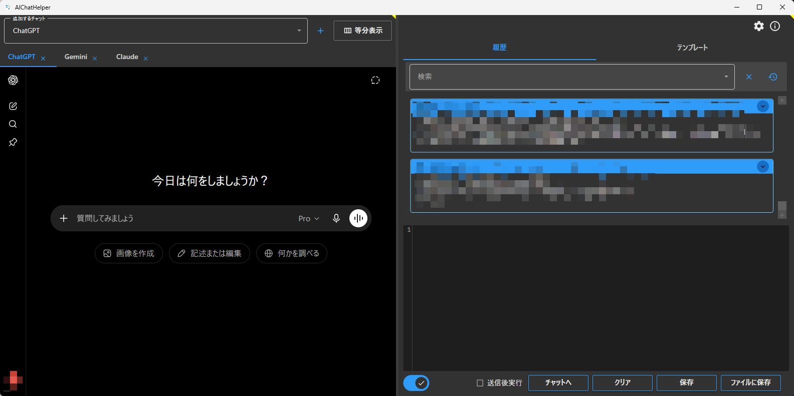
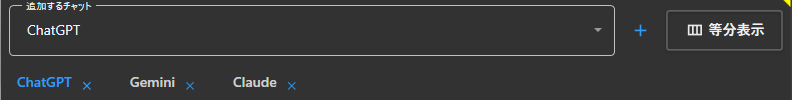
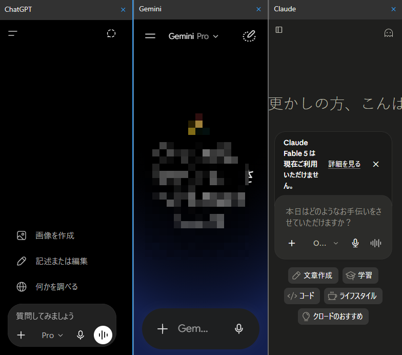
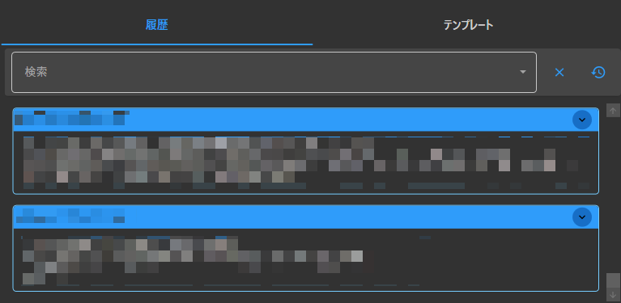
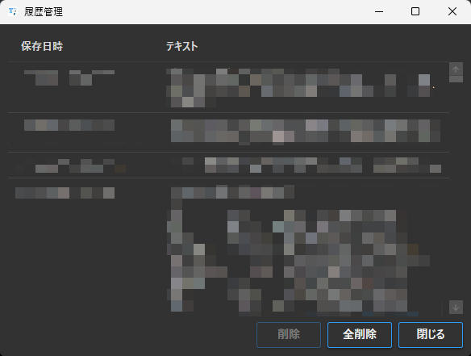
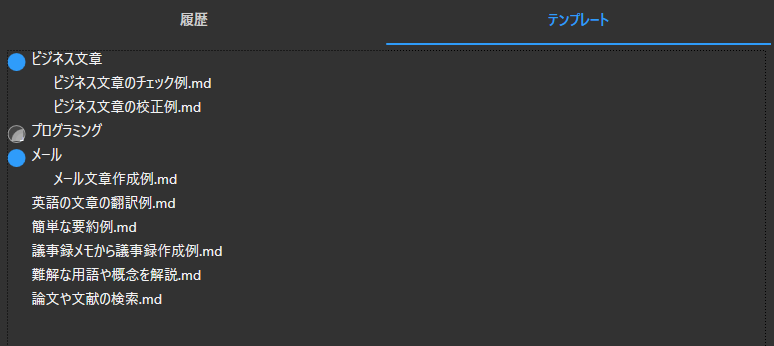
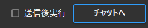
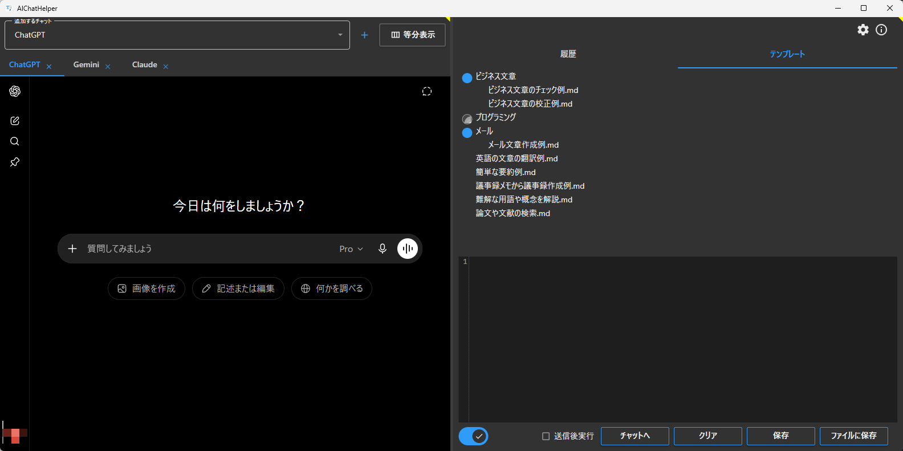
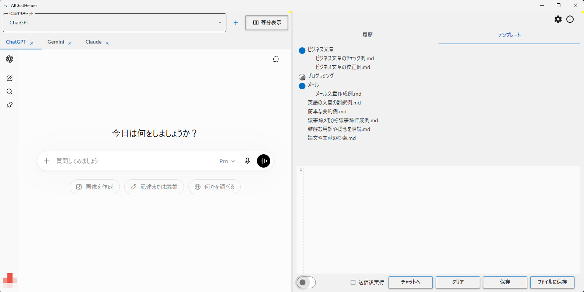

# AIChatHelper

[](https://github.com/kznagamori/AIChatHelper/releases)


## 概要

AIChatHelper は、ChatGPT、Gemini、Claude などの AI チャットサービスを 1 つの WPF デスクトップアプリケーションから扱うためのヘルパーアプリです。

右ペインのエディタでプロンプトを作成し、左ペインの WebView2 タブに表示したチャットサービスへ入力できます。履歴、テンプレート、送信後実行、状態保存、設定ウィンドウを備え、日常的に同じプロンプト作業を繰り返す用途に向いています。

## 主な機能

- `settings.toml` の `[[ChatSites]]` に定義したチャットサービスを左ペインへタブ追加
- 左ペインのチャットタブを閉じる、通常タブ表示と等分表示を切り替える
- 右ペインで履歴タブとテンプレートタブを切り替え
- テンプレートをフォルダー階層付きツリービューで表示
- チャット入力後に、必要に応じてサービス側の実行ボタンも押す「送信後実行」
- ChatGPT、Gemini、Claude 向けの送信後実行設定
- プロンプト履歴の保存、検索、管理
- ダークモード/ライトモード切り替え
- 左右ペインの表示切り替えとサイズ調整
- UI 状態を `settings.toml` に保存して次回起動時に復元
- `settings.toml` を項目別コントロールで編集できる設定ウィンドウ

## インストール方法

### 通常インストール

1. [GitHub Releases](https://github.com/kznagamori/AIChatHelper/releases) から最新のリリースをダウンロードします。
2. ダウンロードした ZIP ファイルを任意のフォルダーに展開します。
3. `AIChatHelper.exe` を実行します。

### ポータブル使用

展開したフォルダーを USB メモリなどに入れて持ち運ぶこともできます。インストーラーは不要で、実行ファイルから直接起動できます。

## 使い方

### 基本操作

1. アプリケーションを起動すると、左ペインにチャットサービス、右ペインに履歴・テンプレート・エディタが表示されます。
2. 左ペイン上部のコンボボックスでチャットサービスを選び、`+` ボタンでタブを追加します。
3. 右ペイン下部のエディタにプロンプトを入力します。
4. 「チャットへ」をクリックするか `Ctrl+Enter` を押すと、選択中のチャットタブの入力欄へプロンプトを反映します。
5. 「送信後実行」をチェックしている場合は、入力後にサービス側の実行ボタンも押します。



### 左ペインのチャットタブ

左ペイン上部には、チャットタブを追加するためのコントロールがあります。

- コンボボックス: `settings.toml` の `[[ChatSites]]` から追加するサービスを選択
- `+` ボタン: 選択したサービスの WebView2 タブを追加
- 表示切替ボタン: 通常タブ表示と、すべてのタブ内容を等幅で並べる等分表示を切り替え
- タブの `×` ボタン: 対象タブを閉じる



等分表示では、表示中のすべてのチャットタブ内容を 1 画面内に等幅で並べます。複数サービスの画面を同時に比較したい場合に使います。



### 履歴

右ペイン上部の `履歴` タブでは、過去に送信したプロンプトを検索・再利用できます。

1. 検索ボックスにキーワードを入力します。
2. `Enter` または検索操作で履歴を絞り込みます。
3. 履歴アイテムを選択すると、内容をエディタへ反映できます。
4. 履歴管理ボタンから、履歴管理ウィンドウを開いて削除や一括削除ができます。





### テンプレート

右ペイン上部の `テンプレート` タブでは、テンプレートファイルをツリービューで表示します。

- フォルダーは `+` / `-` の古いエクスプローラー風表示で展開・折りたたみできます。
- テンプレートファイルを選択またはダブルクリックすると、内容をエディタに反映できます。
- テンプレートの参照先ディレクトリは `settings.toml` の `[Config.TemplateSettings].TemplateDirectory` で指定できます。
- 相対パス、絶対パス、ドライブパス、UNC パスを指定できます。
- ネットワークドライブや UNC パスで認証が必要な場合は、Windows 側の認証ダイアログが表示されることがあります。



標準テンプレートは `template` フォルダーに配置されています。現在は用途別に次のようなフォルダー構成になっています。

```text
template/
  ビジネス文章/
  プログラミング/
  メール/
```

### 送信後実行

通常の「チャットへ」は、エディタ内容をチャットサービスの入力欄へ反映します。右ペイン下部の「送信後実行」をオンにすると、入力反映後にサービス側の送信・実行ボタンも押します。

対応対象:

- ChatGPT
- Gemini
- Claude

実行ボタンの判定は `settings.toml` の `[Config.ExecuteAfterSendSettings]` と `[[Config.ExecuteAfterSendSettings.ServiceExecutors]]` で調整できます。サービス側 UI が変わった場合は、`SubmitButtonSelectors` を更新してください。



### テーマ切り替え

右ペイン下部のテーマ切替ボタンで、ダークモードとライトモードを切り替えられます。テーマ状態は `settings.toml` の `[Config.UiState]` に保存され、次回起動時に復元されます。

*ダークモード**



**ライトモード**




### 表示モード切り替え

左右ペイン上部の黄色い三角形をクリックすると、表示モードを切り替えられます。

- 両方表示
- 左ペインのみ表示
- 右ペインのみ表示

左右ペインの幅は中央のスプリッターで調整できます。

**両方表示**


### アプリケーション情報

右ペイン上部の情報アイコンをクリックすると、アプリケーション情報ウィンドウが開きます。バージョン情報、著作権情報、ライセンス情報などを確認できます。

**ここに、アプリケーション情報ウィンドウのキャプチャ画像を貼ってください。**

## 設定

### 設定ウィンドウ

右ペイン上部の歯車アイコンから設定ウィンドウを開けます。設定ウィンドウを開く直前に、現在の UI 状態が `settings.toml` に保存されます。

設定ウィンドウでは、raw TOML を直接編集するのではなく、各項目に適したコントロールで設定を変更します。

- チャットサイト: `[[ChatSites]]` の追加、削除、並び替え
- 入力欄: `InputSelectors` の追加、削除、並び替え
- エディタ: 上書き確認、クリア時テンプレート挿入、挿入テキスト
- テンプレート: テンプレートディレクトリ
- 送信後実行: タイムアウト、サービス別 URL パターン、実行ボタンセレクター、キーボード代替
- 表示状態: ペイン表示モード、右ペイン選択タブ、テーマ、送信後実行チェック状態、左ペインタブ状態

設定ウィンドウには、このリポジトリと `settings.toml` 設定ガイドへのリンクも表示されます。

**ここに、設定ウィンドウ全体のキャプチャ画像を貼ってください。**

### 状態保存

次の状態は `settings.toml` の `[Config.UiState]` に保存され、次回起動時に復元されます。

- 左ペインで表示しているチャットタブ
- 左ペインのアクティブタブ位置
- アプリ全体のペイン表示モード、`TwoPane` / `LeftPane` / `RightPane`
- 右ペインの選択タブ、`History` または `Template`
- テーマ状態
- 「送信後実行」のチェック状態
- アプリケーションウィンドウの表示サイズ
- アプリケーションウィンドウの表示位置。位置を起動時に復元するかどうかは `RestoreWindowPosition` で制御します。

WebView2 内のページ遷移後 URL、スクロール位置、ログイン状態は保存しません。

### settings.toml

アプリケーションの動作は、実行フォルダーの `settings.toml` で設定できます。主要なセクションは次のとおりです。

- `[[ChatSites]]`: 左ペインに追加できるチャットサービス
- `[Config].InputSelectors`: チャット入力欄を探す CSS セレクター
- `[Config.EditorSettings]`: エディタの確認ダイアログやクリア時テンプレート
- `[Config.TemplateSettings]`: テンプレートディレクトリ
- `[Config.ExecuteAfterSendSettings]`: 送信後実行の基本設定
- `[[Config.ExecuteAfterSendSettings.ServiceExecutors]]`: サービス別の実行設定
- `[Config.UiState]`: アプリが自動保存する表示状態

詳細は [docs/settings-toml.md](docs/settings-toml.md) を参照してください。

設定例:

```toml
[[ChatSites]]
Name = "ChatGPT"
Url = "https://chat.openai.com/"

[[ChatSites]]
Name = "Gemini"
Url = "https://gemini.google.com/app?hl=ja"

[[ChatSites]]
Name = "Claude"
Url = "https://claude.ai/new"

[Config]
InputSelectors = [
    '[contenteditable="true"][role="textbox"]',
    '[contenteditable="true"]',
    'textarea.w-full.resize-none',
    '#copilot-chat-textarea',
    'textarea',
]

[Config.EditorSettings]
ConfirmTemplateOverwrite = false
ConfirmHistoryOverwrite = false
InsertTemplateTextOnClear = false
TemplateTextForEditor = """

"""

[Config.TemplateSettings]
TemplateDirectory = "template"

[Config.ExecuteAfterSendSettings]
DefaultEnabled = false
ExecutionTimeoutMs = 3000
PostInputDelayMs = 100
RetryIntervalMs = 100
EnableDomAnalysisLog = true
UnsupportedServiceBehavior = "InputOnly"

[[Config.ExecuteAfterSendSettings.ServiceExecutors]]
ServiceName = "ChatGPT"
UrlPatterns = ["chat.openai.com", "chatgpt.com"]
SubmitButtonSelectors = [
    'button[data-testid="send-button"]',
    'button[data-testid="composer-submit-button"]',
    'button[aria-label*="Send"]',
    'button[aria-label*="送信"]',
]
KeyboardFallback = "None"
```

## ビルド方法

### 必要条件

- [.NET SDK 10.0](https://dotnet.microsoft.com/download/dotnet/10.0) 以上
- Visual Studio 2022 または Visual Studio Code
- WebView2 Runtime

### ビルド手順

リポジトリをクローンします。

```bash
git clone https://github.com/kznagamori/AIChatHelper.git
cd AIChatHelper
```

開発ビルド:

```bash
dotnet build
```

リリースビルド:

```bash
dotnet publish -c Release -r win-x64 -p:PublishSingleFile=true -p:SelfContained=true -p:PublishTrimmed=false -p:DebugType=None
```

ビルドされた実行ファイルは `bin/Release/net10.0-windows/win-x64/publish` フォルダーに生成されます。

## ライセンス

MIT License - 詳細は [LICENSE](LICENSE) を参照してください。

## 開発者

kznagamori

- GitHub: [https://github.com/kznagamori](https://github.com/kznagamori)
