# AIChatHelper

[](https://github.com/kznagamori/AIChatHelper/releases) 
  

## 概要

AIChatHelper は、ChatGPT、Gemini、Claude などの AI チャットサービスを 1 つの WPF デスクトップアプリケーションから扱うためのヘルパーアプリです。

右ペインのエディタでプロンプトを作成し、左ペインの WebView2 タブに表示したチャットサービスへ入力できます。履歴、テンプレート、送信後実行、状態保存、設定ウィンドウを備え、日常的に同じプロンプト作業を繰り返す用途に向いています。

## 主な機能

- `settings.toml` の `[[ChatSites]]` に定義したチャットサービスを左ペインへタブ追加
- 左ペインのチャットタブを閉じる、タブ表示・縦分割・横分割を切り替える
- 右ペインで履歴タブとテンプレートタブを切り替え
- テンプレートをフォルダー階層付きツリービューで表示
- チャット入力後に、必要に応じてサービス側の実行ボタンも押す「送信後実行」
- ChatGPT、Gemini、Claude 向けの送信後実行設定
- プロンプト履歴の保存、検索、管理
- Windows の設定に合わせる・ライト・ダークの3つから選べるテーマ設定
- 左右ペインの表示切り替えとサイズ調整
- UI 状態を `settings.toml` に保存して次回起動時に復元
- 登録ドメイン内で最後に開いていたチャットページ URL の保存・復元
- 起動時に登録済みチャットサイトだけを初期タブとして開く設定
- `settings.toml` を項目別コントロールで編集できる設定ウィンドウ

## インストール方法

### 通常インストール

1. [GitHub Releases](https://github.com/kznagamori/AIChatHelper/releases) から最新のリリースをダウンロードします。
2. ダウンロードした ZIP ファイルを任意のフォルダーに展開します。
3. `AIChatHelper.exe` を実行します。

### ポータブル使用

展開したフォルダーを USB メモリなどに入れて持ち運ぶこともできます。インストーラーは不要で、実行ファイルから直接起動できます。

## 使い方

### 基本操作

1. アプリケーションを起動すると、左ペインにチャットサービス、右ペインに履歴・テンプレート・エディタが表示されます。
2. 左ペイン上部のコンボボックスでチャットサービスを選び、`+` ボタンでタブを追加します。
3. 右ペイン下部のエディタにプロンプトを入力します。
4. 「チャットへ」をクリックするか `Ctrl+Enter` を押すと、タブ表示で選択中、または分割表示でアクティブなチャットの入力欄へプロンプトを反映します。
5. 「送信後実行」をチェックしている場合は、入力後にサービス側の実行ボタンも押します。

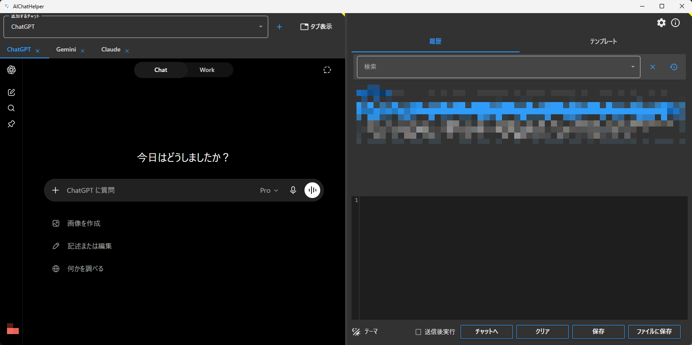

### 左ペインのチャットタブ

左ペイン上部には、チャットタブを追加するためのコントロールがあります。

- コンボボックス: `settings.toml` の `[[ChatSites]]` から追加するサービスを選択
- `+` ボタン: 選択したサービスの WebView2 タブを追加
- 表示切替ボタン: 現在の表示モードを表示し、押すたびにタブ表示・縦分割・横分割を切り替え
- タブの `×` ボタン: 対象タブを閉じる

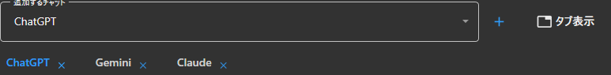

表示モードは、次の順番で切り替わります。

```text
タブ表示 → 縦分割 → 横分割 → タブ表示
```

- タブ表示: 選択中の 1 タブだけを表示
- 縦分割: すべてのタブ内容を左から右へ等幅で表示
- 横分割: すべてのタブ内容を上から下へ等高で表示

分割表示では、各ペインのタブ名と閉じるボタンが表示されます。ペインをクリックするか WebView2 にフォーカスすると、そのペインがアクティブになり、枠線で識別できます。「チャットへ」はアクティブな 1 ペインだけを対象にします。

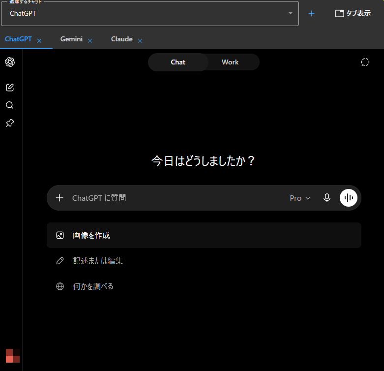

**縦分割**

複数サービスの画面を左右に並べて比較する場合に使います。ペイン間の幅は均等です。

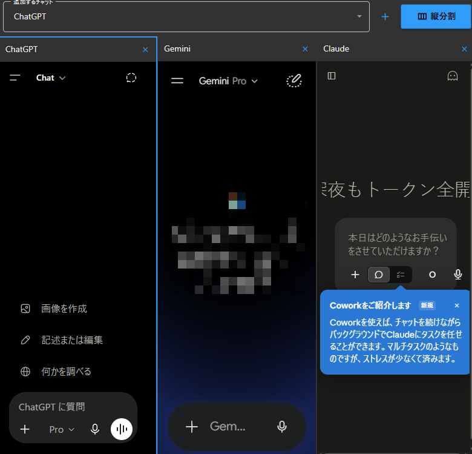

**横分割**

複数サービスの画面を上下に並べて比較する場合に使います。ペイン間の高さは均等です。

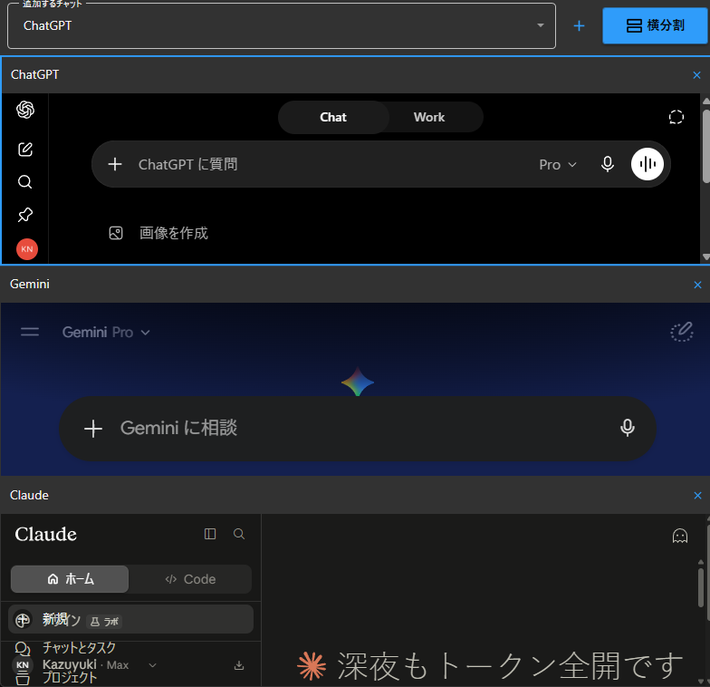

タブ表示・縦分割・横分割の状態は `settings.toml` へ保存されません。アプリケーションを再起動するとタブ表示で開始します。表示中のタブ一覧とアクティブタブ位置は従来どおり保存されます。

設定ウィンドウの「表示状態」では、タブを次回起動時に復元する方法を変更できます。

- `前回開いていたページ URL を保存・復元する`: 登録 URL と同じドメイン内で最後に表示していたページから再開
- `起動時は常に登録済みチャットサイトへ戻す`: 前回のタブ状態を使わず、`[[ChatSites]]` を登録順に各 1 タブずつ開く

両方を有効にした場合は、登録済みチャットサイトへ戻す設定が優先されます。外部リンクや登録 URL と別ドメインのページは保存されません。

### 履歴

右ペイン上部の `履歴` タブでは、過去に送信したプロンプトを検索・再利用できます。

1. 検索ボックスにキーワードを入力します。
2. `Enter` を押して履歴を絞り込みます。
3. 履歴アイテムをダブルクリックすると、内容をエディタへ反映できます。
4. 履歴管理ボタンから、履歴管理ウィンドウを開いて削除や一括削除ができます。

検索を解除する場合は、検索欄右側のクリアボタンを押します。

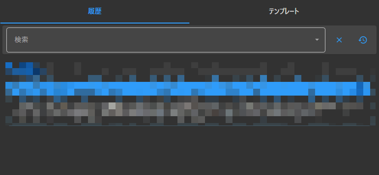

### テンプレート

右ペイン上部の `テンプレート` タブでは、テンプレートファイルをツリービューで表示します。

- フォルダーは `+` / `-` の古いエクスプローラー風表示で展開・折りたたみできます。
- テンプレートファイルをダブルクリックするか、選択して `Enter` を押すと、内容をエディタに反映できます。
- テンプレートの参照先ディレクトリは `settings.toml` の `[Config.TemplateSettings].TemplateDirectory` で指定できます。
- 相対パス、絶対パス、ドライブパス、UNC パスを指定できます。
- ネットワークドライブや UNC パスで認証が必要な場合は、Windows 側の認証ダイアログが表示されることがあります。

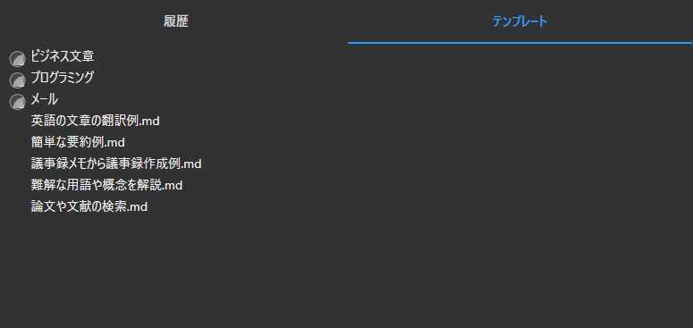

標準テンプレートは `template` フォルダーに配置されています。現在は用途別に次のようなフォルダー構成になっています。

```text
template/
  ビジネス文章/
  プログラミング/
  メール/
```

### 送信後実行

通常の「チャットへ」は、エディタ内容をチャットサービスの入力欄へ反映します。右ペイン下部の「送信後実行」をオンにすると、入力反映後にサービス側の送信・実行ボタンも押します。

対応対象:

- ChatGPT
- Gemini
- Claude

実行ボタンの判定は `settings.toml` の `[Config.ExecuteAfterSendSettings]` と `[[Config.ExecuteAfterSendSettings.ServiceExecutors]]` で調整できます。サービス側 UI が変わった場合は、`SubmitButtonSelectors` を更新してください。

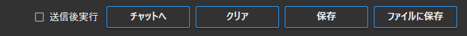

### テーマ切り替え

右ペイン下部のアイコンと「テーマ」ラベルが付いたメニューから、「Windows の設定に合わせる」「ライト」「ダーク」を選択できます。テーマ操作、「送信後実行」、各コマンドボタンは同じ1段に表示されます。選択したテーマモードは `settings.toml` の `[Config.UiState]` に保存され、次回起動時に復元されます。

「Windows の設定に合わせる」を選択している間は、アプリ起動中に Windows のアプリテーマを変更した場合も表示へ反映されます。

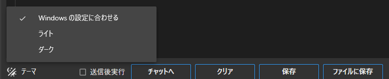

**ダークモード**


**ライトモード**

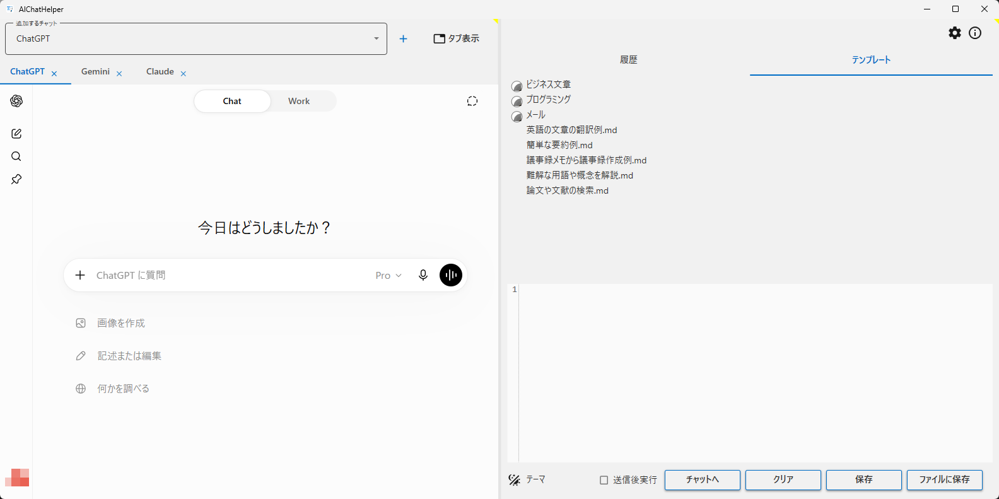

### アプリ全体のペイン表示切り替え

左右ペイン上部の黄色い三角形をクリックすると、表示モードを切り替えられます。

- 両方表示
- 左ペインのみ表示
- 右ペインのみ表示

左右ペインの幅は中央のスプリッターで調整できます。

**両方表示**

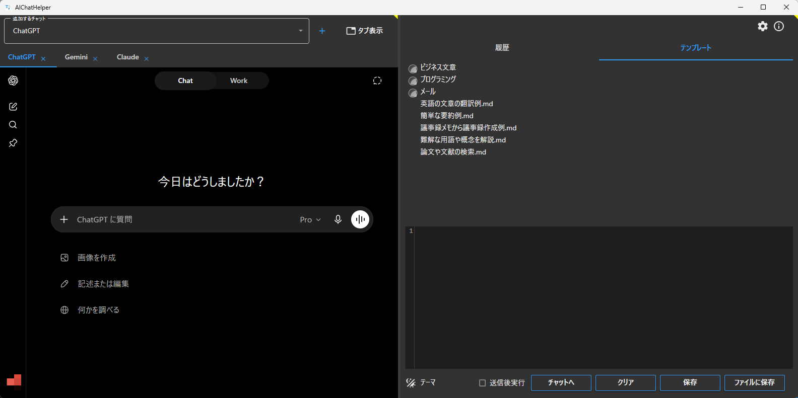

**左ペインのみ表示**

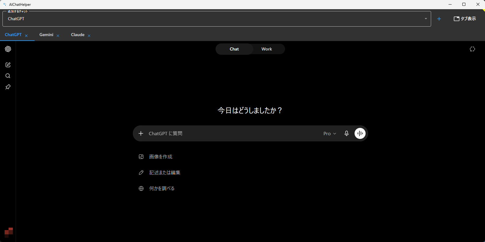

**右ペインのみ表示**

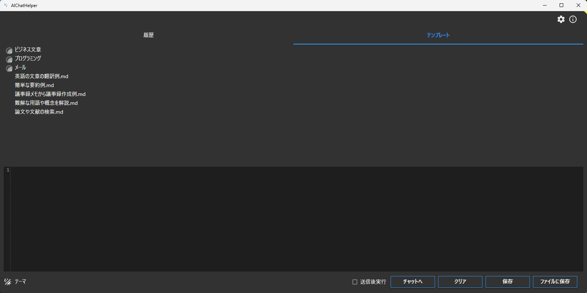

### アプリケーション情報

右ペイン上部の情報アイコンをクリックすると、アプリケーション情報ウィンドウが開きます。バージョン情報、著作権情報、ライセンス情報などを確認できます。

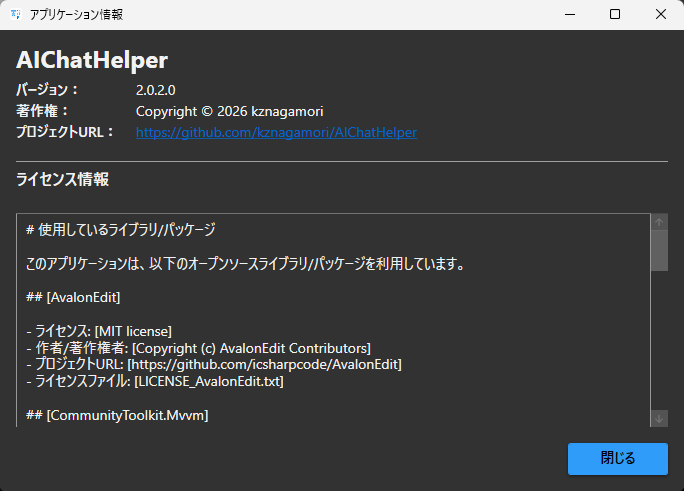

## 設定

### 設定ウィンドウ

右ペイン上部の歯車アイコンから設定ウィンドウを開けます。設定ウィンドウを開く直前に、現在の UI 状態が `settings.toml` に保存されます。

設定ウィンドウでは、raw TOML を直接編集するのではなく、各項目に適したコントロールで設定を変更します。

設定項目は「基本設定」と「詳細設定」に分かれています。設定ウィンドウを開いた時は基本設定が表示されます。

- 基本設定: テーマ、ウィンドウ位置復元、チャットサイト、エディタ、テンプレートディレクトリ、タブ復元
- 詳細設定: チャットサイト、入力欄、エディタ、テンプレート、送信後実行、表示状態

基本設定と詳細設定に重複して表示される項目は同期されます。どちらで編集しても、保存前からもう一方へ同じ値が反映されます。

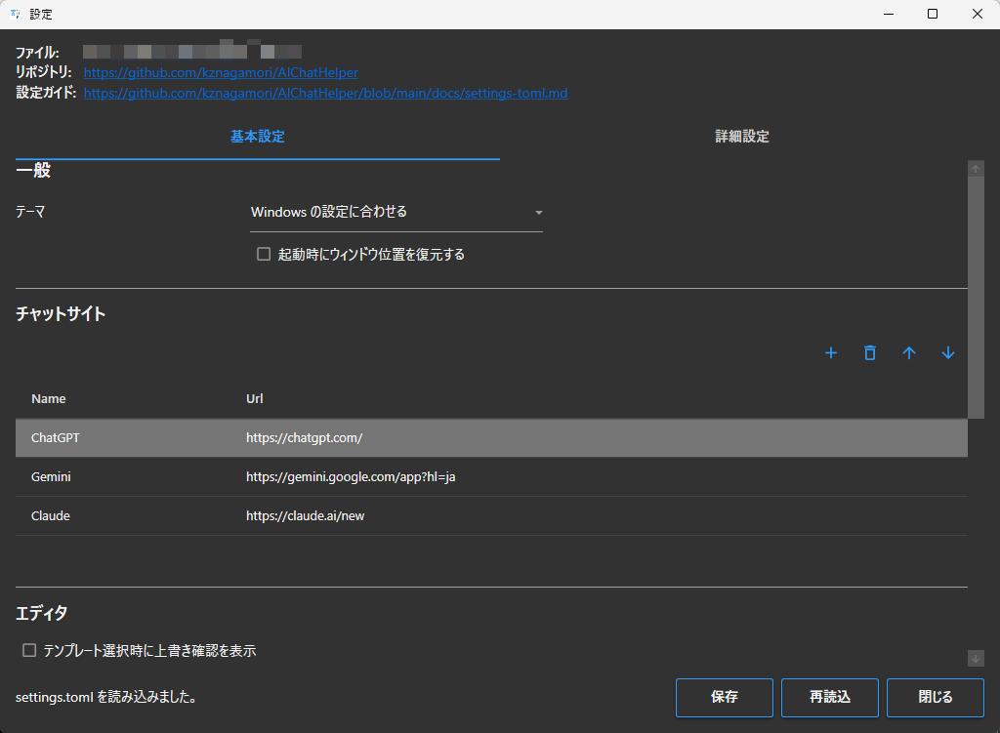

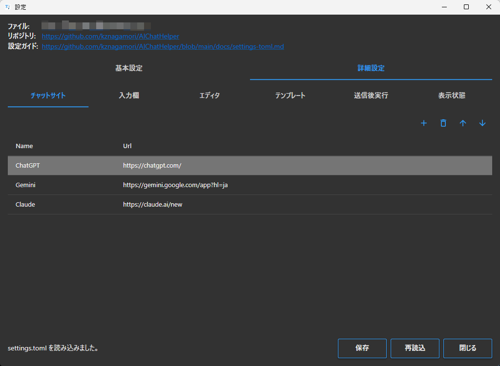

設定ウィンドウには、このリポジトリと `settings.toml` 設定ガイドへのリンクも表示されます。

画面下部の操作は次のとおりです。

- `保存`: 入力内容を検証して `settings.toml` へ保存
- `再読込`: 未保存の編集内容を破棄し、現在の `settings.toml` を再読込
- `閉じる`: 設定ウィンドウを閉じる。未保存の編集内容は保存されず、保存済みのテーマ、ペイン表示、右ペイン選択、送信後実行、ウィンドウ設定がメイン画面へ再反映

チャットサイト、入力欄セレクター、エディタ、テンプレート、送信後実行の詳細設定は、確実に反映するため保存後にアプリケーションを再起動してください。

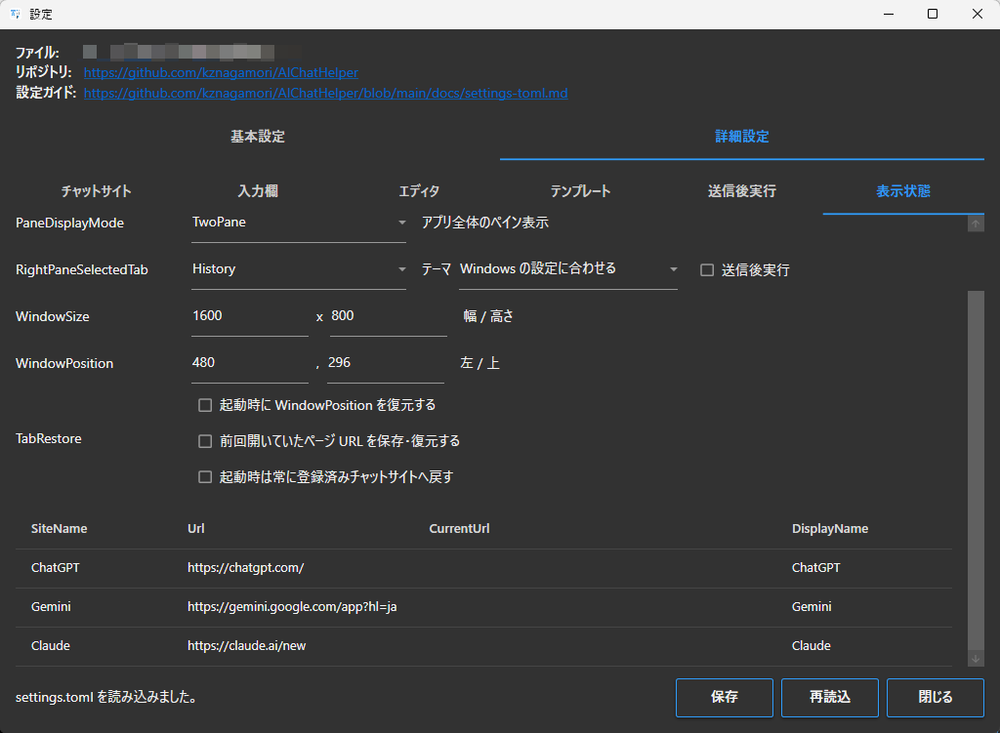

次の状態は `settings.toml` の `[Config.UiState]` に保存され、次回起動時に復元されます。

- 左ペインで表示しているチャットタブ
- 左ペインのアクティブタブ位置
- URL 保存・復元が有効な場合の、登録ドメイン内で最後に表示していた URL
- アプリ全体のペイン表示モード、`TwoPane` / `LeftPane` / `RightPane`
- 右ペインの選択タブ、`History` または `Template`
- テーマモード。Windows 設定追従、ライト固定、ダーク固定
- 「送信後実行」のチェック状態
- アプリケーションウィンドウの表示サイズ
- アプリケーションウィンドウの表示位置。位置を起動時に復元するかどうかは `RestoreWindowPosition` で制御します。

WebView2 内のスクロール位置やページ内 UI 状態は保存しません。ログイン状態は既存の WebView2 ユーザーデータに依存します。

左ペイン内のタブ表示・縦分割・横分割は保存対象外で、起動時はタブ表示になります。

### settings.toml

アプリケーションの動作は、実行フォルダーの `settings.toml` で設定できます。主要なセクションは次のとおりです。

- `[[ChatSites]]`: 左ペインに追加できるチャットサービス
- `[Config]` の `InputSelectors`: チャット入力欄を探す CSS セレクター
- `[Config.EditorSettings]`: エディタの確認ダイアログやクリア時テンプレート
- `[Config.TemplateSettings]`: テンプレートディレクトリ
- `[Config.TabRestoreSettings]`: タブ URL と初期タブの復元方法
- `[Config.ExecuteAfterSendSettings]`: 送信後実行の待機時間と未対応時の動作
- `[[Config.ExecuteAfterSendSettings.ServiceExecutors]]`: サービス別の実行設定
- `[Config.UiState]`: アプリが自動保存する表示状態

詳細は [docs/settings-toml.md](docs/settings-toml.md) を参照してください。

設定例:

```toml
[[ChatSites]]
Name = "ChatGPT"
Url = "https://chatgpt.com/"

[[ChatSites]]
Name = "Gemini"
Url = "https://gemini.google.com/app?hl=ja"

[[ChatSites]]
Name = "Claude"
Url = "https://claude.ai/new"

[Config]
InputSelectors = [
    '[contenteditable="true"][role="textbox"]',
    '[contenteditable="true"]',
    'textarea.w-full.resize-none',
    '#copilot-chat-textarea',
    'textarea',
]

[Config.EditorSettings]
ConfirmTemplateOverwrite = false
ConfirmHistoryOverwrite = false
InsertTemplateTextOnClear = false
TemplateTextForEditor = """

"""

[Config.TemplateSettings]
TemplateDirectory = "template"

[Config.TabRestoreSettings]
SaveAndRestoreTabUrls = false
AlwaysRestoreInitialTabs = false

[Config.ExecuteAfterSendSettings]
ExecutionTimeoutMs = 3000
PostInputDelayMs = 100
RetryIntervalMs = 100
EnableDomAnalysisLog = true
UnsupportedServiceBehavior = "InputOnly"

[[Config.ExecuteAfterSendSettings.ServiceExecutors]]
ServiceName = "ChatGPT"
UrlPatterns = ["chat.openai.com", "chatgpt.com"]
SubmitButtonSelectors = [
    'button[data-testid="send-button"]',
    'button[data-testid="composer-submit-button"]',
    'button[aria-label*="Send"]',
    'button[aria-label*="送信"]',
]
KeyboardFallback = "None"
```

## ビルド方法

### 必要条件

- [.NET SDK 10.0](https://dotnet.microsoft.com/download/dotnet/10.0) 以上
- Visual Studio 2022 または Visual Studio Code
- WebView2 Runtime

### ビルド手順

リポジトリをクローンします。

```bash
git clone https://github.com/kznagamori/AIChatHelper.git
cd AIChatHelper
```

開発ビルド:

```bash
dotnet build
```

リリースビルド:

```bash
dotnet publish -c Release -r win-x64 -p:PublishSingleFile=true -p:SelfContained=true -p:PublishTrimmed=false -p:DebugType=None
```

ビルドされた実行ファイルは `bin/Release/net10.0-windows/win-x64/publish` フォルダーに生成されます。

## ライセンス

MIT License - 詳細は [LICENSE](LICENSE) を参照してください。

## 開発者

kznagamori

- GitHub: [https://github.com/kznagamori](https://github.com/kznagamori)
