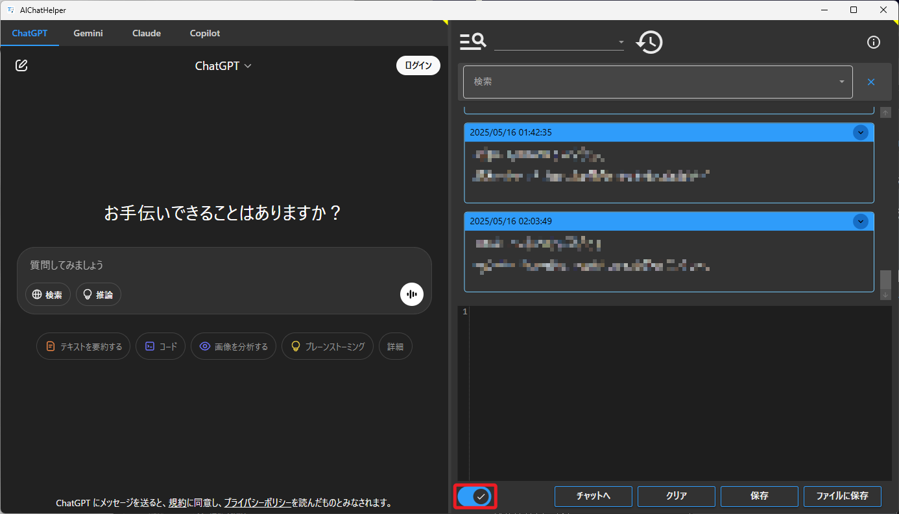

# AIChatHelper

[](LICENSE)

## 概要

AIChatHelperは、複数のAIチャットサービス（ChatGPT、Claude、Gemini、Phindなど）を一つのアプリケーションから簡単に利用できるWPFデスクトップアプリケーションです。AIチャットサービスへのプロンプト管理、テンプレートの保存・使用、履歴の記録といった機能を提供し、AIチャットサービスの利用効率を高めます。

### 主な機能

- 複数のAIチャットサービスをタブで切り替え可能
- プロンプトの保存と再利用
- テンプレート機能によるプリセットプロンプトの管理
- チャット履歴の保存と管理
- 履歴検索機能
- ダークモード/ライトモード対応
- 左右パネルのサイズ調整と表示切替
- 設定ファイルによるカスタマイズ

## インストール方法

### 通常インストール

1. [GitHub Releases](https://github.com/kznagamori/AIChatHelper/releases) から最新のリリースをダウンロードします
2. ダウンロードしたZIPファイルを任意のフォルダーに展開します
3. `AIChatHelper.exe` を実行してアプリケーションを起動します

### ポータブル使用

- 展開したフォルダーは、USBメモリなどに入れて持ち運ぶことも可能です
- アプリケーションはインストールせず、実行ファイルから直接起動できます

## 使い方

### 基本的な使い方

1. アプリケーションを起動すると、左側にAIチャットサービスのタブ、右側にエディター領域が表示されます
2. 利用したいAIチャットサービスのタブを選択します
3. エディター領域にプロンプトを入力します
4. 「チャットへ」ボタンをクリックするか、Ctrl+Enterキーを押すとプロンプトがAIチャットサービスに送信されます


### テンプレート機能

1. 上部のテンプレート選択ドロップダウンからテンプレートを選択できます
    
2. テンプレートフォルダーボタン（虫眼鏡アイコン）をクリックすると、テンプレートフォルダーが開きます
    
3. テンプレートフォルダーにテキストファイルを追加すると、新しいテンプレートとして利用できます

### 履歴管理

1. エディター上部の履歴表示エリアには、以前使用したプロンプトが日付別に表示されます
    
2. 履歴アイテムをダブルクリックすると、そのプロンプトがエディターに読み込まれます
3. 履歴カードの右上にある展開ボタン（下向き矢印アイコン）をクリックすると、履歴の全文が表示されます
   - 展開状態では上向き矢印アイコンに変わり、再度クリックすると折りたたまれます
   - 通常状態では履歴は省略表示されますが、展開するとスクロール可能な全文表示になります
    
4. 履歴管理ボタン（時計アイコン）をクリックすると、履歴管理ウィンドウが開きます
    
5. 履歴管理ウィンドウでは、過去のプロンプトの削除や一括削除ができます
    

### 履歴検索機能

1. エディター上部の検索ボックスに検索したいキーワードを入力します
2. Enterキーを押すか、検索ボタンをクリックすると、入力したキーワードを含む履歴が表示されます
3. 検索履歴はドロップダウンで表示され、過去の検索キーワードを再利用できます
4. 検索をクリアするには、検索ボックス右側のクリアボタン（×マーク）をクリックします


### 表示モード切替

1. 右上や左上の黄色い三角形をクリックすると、表示モードを切り替えられます
2. 左ペインのみ表示、右ペインのみ表示、両方表示の3つのモードがあります


### テーマ切替

- 左下のトグルボタンをクリックすると、ダークモードとライトモードを切り替えられます



##### Lightモード


##### Darkモード


### アプリケーション情報

- 右上の情報アイコンをクリックすると、アプリケーション情報ウィンドウが開きます
- バージョン情報、著作権情報、ライセンス情報などが表示されます


## カスタマイズ

### 設定ファイル（settings.toml）

アプリケーションの動作は `settings.toml` ファイルで設定できます。このファイルはアプリケーションと同じフォルダにあります。設定ファイルを編集することで、さまざまな機能をカスタマイズできます。

```toml
[[ChatSites]]
Name = "ChatGPT"
Url = "https://chat.openai.com/"

[[ChatSites]]
Name = "Claude"
Url = "https://claude.ai/new"

# 他のAIチャットサービスも同様に設定可能

[Config]
# テキスト入力欄の検索条件（優先度が上の順に並べる）
InputSelectors = [
    '[contenteditable="true"][role="textbox"]',
    '[contenteditable="true"]',
    'textarea.w-full.resize-none',
    '#copilot-chat-textarea',
    'textarea',
]

[Config.EditorSettings]
ConfirmTemplateOverwrite = false
ConfirmHistoryOverwrite = false
# TextEditor がクリア状態になった時にテンプレートテキストを挿入するかどうか
InsertTemplateTextOnClear = false
# 挿入するテンプレートテキスト
TemplateTextForEditor = """

"""
```

#### 設定項目の詳細

##### ChatSites セクション

ChatSitesセクションでは、アプリケーションで使用するAIチャットサービスを設定できます。各チャットサービスについて以下の項目を設定します：

```toml
[[ChatSites]]
Name = "サービス名"    # タブに表示される名前
Url = "サービスのURL"  # チャットサービスのURL
```

標準では以下のサービスが設定されています：
- ChatGPT (OpenAI)
- Gemini (Google)
- Claude (Anthropic)
- Microsoft Copilot

これらの設定を変更したり、新しいチャットサービスを追加したりすることができます。例えば、自社のAIチャットボットを追加する場合は以下のように追加します：

```toml
[[ChatSites]]
Name = "社内ボット"
Url = "https://internal-chatbot.company.com/"
```

##### Config セクション

Configセクションでは、アプリケーションの一般的な設定を行います：

```toml
[Config]
# テキスト入力欄の検索条件（優先度が上の順に並べる）
InputSelectors = [
    '[contenteditable="true"][role="textbox"]',
    '[contenteditable="true"]',
    'textarea.w-full.resize-none',
    '#copilot-chat-textarea',
    'textarea',
]
```

`InputSelectors` は、各チャットサービスの入力欄を特定するためのCSSセレクターのリストです。リストの順番が優先順位となり、最初に一致する要素が入力欄として使用されます。

多くのチャットサービスでは標準の設定で動作しますが、サービスの仕様変更や特殊なUIを持つサービスを使用する場合は、適切なCSSセレクターを追加する必要があるかもしれません。

##### EditorSettings セクション

エディターの動作に関する詳細な設定を行います：

```toml
[Config.EditorSettings]
# テンプレート選択時に確認ダイアログを表示するか
ConfirmTemplateOverwrite = true

# 履歴選択時に確認ダイアログを表示するか
ConfirmHistoryOverwrite = true

# テキストエディターがクリア状態になった時にテンプレートテキストを挿入するか
InsertTemplateTextOnClear = true

# 挿入するテンプレートテキスト
TemplateTextForEditor = """
回答は、日本語で出力してください。

"""
```

- `ConfirmTemplateOverwrite`: テンプレートを選択した際に、現在のエディターの内容を上書きする前に確認ダイアログを表示するかどうかを設定します。`true`の場合は確認ダイアログが表示され、`false`の場合は確認なしで上書きされます。

- `ConfirmHistoryOverwrite`: 履歴アイテムをダブルクリックした際に、現在のエディターの内容を上書きする前に確認ダイアログを表示するかどうかを設定します。`true`の場合は確認ダイアログが表示され、`false`の場合は確認なしで上書きされます。

- `InsertTemplateTextOnClear`: 「クリア」ボタンを押した際や、チャットへの送信後にエディターをクリアする際に、デフォルトのテンプレートテキストを挿入するかどうかを設定します。`true`の場合はテンプレートテキストが挿入され、`false`の場合は空になります。

- `TemplateTextForEditor`: `InsertTemplateTextOnClear`が`true`の場合に挿入されるテンプレートテキストを設定します。よく使うプロンプトの接頭辞や指示文をここに設定しておくと便利です。複数行のテキストを設定する場合は、三重引用符（`"""～"""）で囲みます。

##### 設定ファイルの適用タイミング

設定ファイルの変更はアプリケーションの再起動後に適用されます。設定ファイルを編集した後は、アプリケーションを一度終了し、再度起動してください。

##### 設定ファイルの例
```
[[ChatSites]]
Name = "ChatGPT"
Url = "https://chat.openai.com/"
[[ChatSites]]
Name = "Gemini"
Url = "https://gemini.google.com/app?hl=ja"

[[ChatSites]]
Name = "Claude"
Url = "https://claude.ai/new"

[[ChatSites]]
Name = "Phind"
Url = "https://www.phind.com/"

[[ChatSites]]
Name = "Perplexity"
Url = "https://www.perplexity.ai/"

[[ChatSites]]
Name = "GitHub Copilot"
Url = "https://github.com/copilot"

[[ChatSites]]
Name = "Copilot"
Url = "https://copilot.microsoft.com/"

[Config]
# テキスト入力欄の検索条件（優先度が上の順に並べる）
InputSelectors = [
	'[contenteditable="true"][role="textbox"]',
	'[contenteditable="true"]',
	'textarea.w-full.resize-none',
	'#copilot-chat-textarea',
	'textarea',
]


[Config.EditorSettings]
ConfirmTemplateOverwrite = true
ConfirmHistoryOverwrite = true
# TextEditor がクリア状態になった時にテンプレートテキストを挿入するかどうか
InsertTemplateTextOnClear = true
# 挿入するテンプレートテキスト
TemplateTextForEditor = """
回答は、日本語で出力してください。

"""
```


## ビルド方法

### 必要条件

- [.NET SDK 9.0](https://dotnet.microsoft.com/download/dotnet/9.0) 以上
- Visual Studio 2022 または Visual Studio Code

### ビルド手順

1. リポジトリをクローンします：

```bash
git clone https://github.com/kznagamori/AIChatHelper.git
cd AIChatHelper
```

2. プロジェクトをビルドします：

```bash
# 開発ビルド
dotnet build

# リリースビルド
dotnet publish -c Release -r win-x64 -p:PublishSingleFile=true -p:SelfContained=true -p:PublishTrimmed=false -p:DebugType=None
```

または、Visual Studio Code内でタスク「publish-release」を実行します：

```
Tasks > Run Task > publish-release
```

ビルドされた実行ファイルは `bin/Release/net9.0-windows/win-x64/publish` フォルダに生成されます。

## ライセンス

MIT License - 詳細は[LICENSE](LICENSE)ファイルを参照してください。

## 開発者

kznagamori

- GitHub: [https://github.com/kznagamori](https://github.com/kznagamori)
